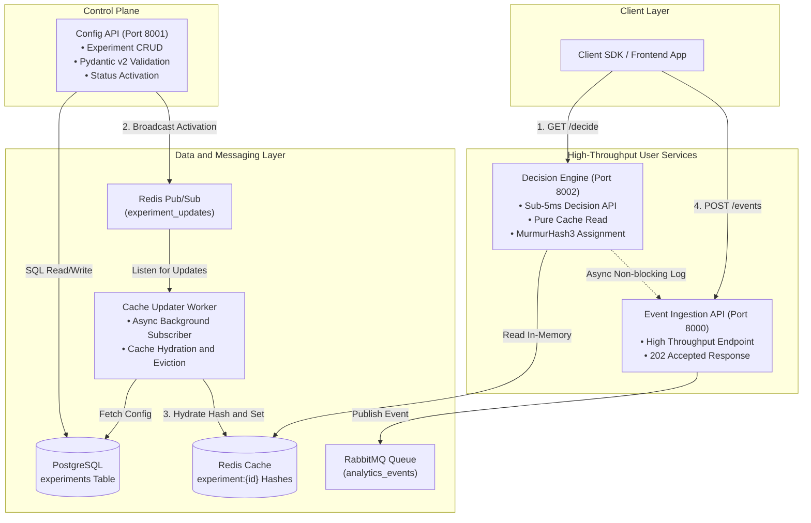
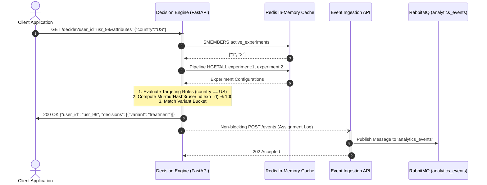
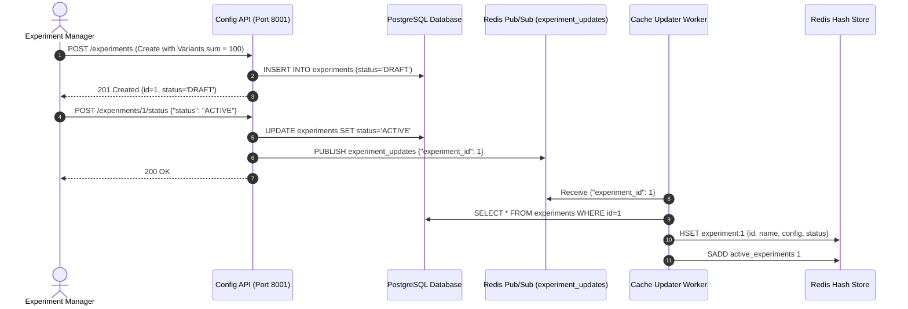

# 🚀 High-Performance A/B Testing Platform

[](https://www.python.org/)
[](https://fastapi.tiangolo.com/)
[](https://docs.pydantic.dev/)
[](https://redis.io/)
[](https://www.rabbitmq.com/)
[](https://www.postgresql.org/)
[](https://www.docker.com/)
[](https://pylint.pycqa.org/)
[](https://pytest.org/)

An enterprise-grade, distributed **A/B Testing and Feature Experimentation Platform** engineered for **sub-5ms decision latency**, real-time cache hydration via Redis Pub/Sub, and high-throughput asynchronous event ingestion powered by RabbitMQ.

---

## 🌟 Key Capabilities

- **⚡ Sub-5ms Decision Engine**: Pure in-memory cache reads from Redis with zero database bottleneck during high-traffic evaluation.
- **🛡️ Strict Pydantic v2 Modeling**: Automatic data integrity validation enforcing 100% traffic weight sums and discriminated union targeting rules.
- **🔄 Real-Time Cache Invalidation**: Asynchronous Redis Pub/Sub events dispatch instant cache hydration/eviction across cluster nodes.
- **🎯 Deterministic Assignment**: MurmurHash3 consistent hashing guarantees user consistency across visits without storing user session states.
- **📥 Durable Event Ingestion**: High-throughput analytics endpoint returning `202 Accepted` immediately while publishing events to RabbitMQ.
- **🐳 Full Containerization**: One-command reproducible local and production deployment via Docker Compose with healthchecks on all services.

---

## 🏛 System Architecture



---

## 🔄 End-to-End Execution Flows

### 1. User Variant Decision Flow (`GET /decide`)


### 2. Experiment Lifecycle & Real-Time Cache Update Flow


---

## 🗂 Code Structure & Organization

```
.
├── .env.example              # Environment variables template
├── .gitignore                # Virtualenv and temporary files exclusion
├── .pylintrc                 # Pylint configuration (10.00/10.00 score)
├── docker-compose.yml        # Orchestrates all 7 services with healthchecks
├── requirements.txt          # Production Python dependencies
├── submission.json           # Automated evaluation seed metadata
├── README.md                 # Primary system overview and user guide
├── architecture.md           # Deep architectural specification
├── projectdocumentation.md   # Complete technical manual and API reference
├── scripts/
│   ├── init_db.sql           # Database schema and seed data
│   └── e2e_test.py           # Live end-to-end verification script
├── common/                   # Shared microservices library
│   ├── __init__.py
│   ├── config.py             # Centralized Pydantic settings
│   ├── models.py             # Pydantic v2 schemas and validators
│   └── hashing.py            # MurmurHash3 consistent assignment algorithm
├── config_api/               # Configuration API microservice (Port 8001)
│   ├── __init__.py
│   ├── database.py           # Async SQLAlchemy ORM and session pool
│   ├── main.py               # REST endpoints for experiment CRUD
│   └── Dockerfile
├── cache_updater/            # Redis Pub/Sub Cache Updater worker
│   ├── __init__.py
│   ├── main.py               # Background listener and cache sync worker
│   └── Dockerfile
├── decision_engine/          # Ultra-low latency decision API (Port 8002)
│   ├── __init__.py
│   ├── main.py               # Cache-only evaluation and non-blocking logging
│   └── Dockerfile
├── event_api/                # High-throughput event ingestion API (Port 8000)
│   ├── __init__.py
│   ├── main.py               # RabbitMQ asynchronous producer
│   └── Dockerfile
└── tests/                    # Unit and integration test suite
    ├── __init__.py
    ├── test_models.py        # Pydantic validation tests
    ├── test_hashing.py       # Deterministic assignment and targeting tests
    └── test_apis.py          # API route and error status tests
```

---

## 🚀 Quick Start & Local Execution

### Prerequisites
- [Docker Engine and Docker Compose](https://docs.docker.com/get-docker/)
- [Python 3.11+](https://www.python.org/)

### 1. Clone & Configure
```bash
git clone https://github.com/ramalokeshreddyp/ab-testing-platform.git
cd ab-testing-platform
cp .env.example .env
```

### 2. Start the Distributed Stack
```bash
docker-compose up -d --build
```
All containers will start and reach `healthy` status automatically:
- `ab_testing_db` (PostgreSQL on port `5432`)
- `ab_testing_cache` (Redis on port `6379`)
- `ab_testing_queue` (RabbitMQ on ports `5672`, `15672`)
- `ab_testing_config_api` (FastAPI on port `8001`)
- `ab_testing_cache_updater` (Background Worker)
- `ab_testing_decision_engine` (FastAPI on port `8002`)
- `ab_testing_event_api` (FastAPI on port `8000`)

---

## 🧪 Testing & Quality Assurance

### Run Unit and Integration Tests
```bash
# Setup virtual environment
python -m venv .venv
source .venv/bin/activate  # On Windows: .venv\Scripts\activate
pip install -r requirements.txt

# Run pytest suite
pytest tests/ -v
```

### Run Pylint Code Quality Check
```bash
pylint --rcfile=.pylintrc common config_api cache_updater decision_engine event_api tests
# Output: Your code has been rated at 10.00/10
```

### Run Live End-to-End System Test
```bash
python scripts/e2e_test.py
```

---

## 📖 API Documentation & Examples

| Service | Port | Endpoint | Method | Description |
|---|---|---|---|---|
| **Config API** | `8001` | `/experiments` | `POST` | Create new experiment (requires variants weight sum = 100) |
| **Config API** | `8001` | `/experiments/{id}/status` | `POST` | Update status (`ACTIVE`/`INACTIVE`) and trigger cache sync |
| **Config API** | `8001` | `/experiments` | `GET` | List all experiments |
| **Decision Engine** | `8002` | `/decide` | `GET` | Get variant assignments for `user_id` (< 5ms) |
| **Event API** | `8000` | `/events` | `POST` | Ingest conversion/assignment events to RabbitMQ (`202 Accepted`) |

For comprehensive architectural design and technical details, please see:
- [architecture.md](architecture.md)
- [projectdocumentation.md](projectdocumentation.md)
