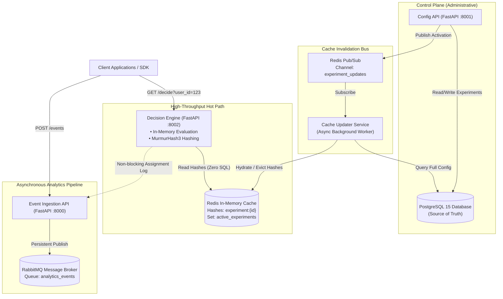
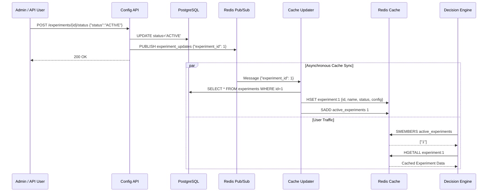

# 🏛 System Architecture & Design Specification

## 1. System Overview & Core Objectives

The **High-Performance A/B Testing Platform** is a distributed experimentation system engineered to resolve the classic tradeoff in feature flagging: **extreme user-facing read performance vs. real-time administrative consistency**.

### Primary Design Objectives:
1. **Ultra-Low Latency Decision Making**: The decision engine must serve variant assignments in **< 5ms** without ever executing database queries in the hot request path.
2. **Zero-Session Determinism**: Assignments must be mathematically deterministic based on user IDs and experiment configurations without requiring sticky sessions or stateful database lookups.
3. **Real-Time Asynchronous Invalidation**: Updating an experiment in the control plane must propagate to all edge cache nodes within milliseconds via Redis Pub/Sub.
4. **Resilient High-Volume Ingestion**: Ingesting assignment and conversion analytics must never degrade decision-making performance; analytics events are decoupled via RabbitMQ.
5. **Strict Data Modeling**: Complex targeting rules and variant weights must be strictly validated at the API boundary using Pydantic v2.

---

## 2. Distributed Microservices Topology

---

## 3. Detailed Component Decomposition

### 3.1 Configuration API (`config_api`)
- **Role**: System control plane providing RESTful experiment management.
- **Key Responsibilities**:
  - Validates request payloads with Pydantic v2 schemas (`ExperimentCreate`, `ExperimentUpdate`, `StatusUpdate`).
  - Persists experiments, variant weights, and targeting rules in PostgreSQL JSONB column.
  - On activation or update of an active experiment, publishes `{"experiment_id": <id>}` to Redis Pub/Sub channel `experiment_updates`.

### 3.2 Cache Updater (`cache_updater`)
- **Role**: Background worker ensuring event-driven cache coherence.
- **Key Responsibilities**:
  - Subscribes to Redis Pub/Sub channel `experiment_updates`.
  - Upon receiving an event, loads the experiment from PostgreSQL.
  - If `status == 'ACTIVE'`: Populates Redis Hash `experiment:{id}` with fields (`id`, `name`, `status`, `config`) and adds ID to Redis Set `active_experiments`.
  - If `status != 'ACTIVE'` or deleted: Deletes `experiment:{id}` and removes ID from `active_experiments`.
  - Hydrates all active experiments from PostgreSQL on initial startup.

### 3.3 Decision Engine (`decision_engine`)
- **Role**: User-facing high-performance decision service.
- **Key Responsibilities**:
  - Reads active experiment IDs from Redis Set `active_experiments` and fetches experiment configurations using Redis pipelining.
  - Evaluates user attributes against discriminated union targeting rules (`EQUALS`, `IN_LIST`, `NOT_EQUALS`).
  - Executes MurmurHash3 deterministic assignment:
    $$	ext{bucket} = 	ext{MurmurHash3}(	ext{user\_id} : 	ext{experiment\_id}) \pmod{100}$$
  - Returns variant assignment with average latency **< 5ms**.
  - Dispatches non-blocking async HTTP POST to Event Ingestion API.

### 3.4 Event Ingestion API (`event_api`)
- **Role**: High-throughput analytics front door.
- **Key Responsibilities**:
  - Validates event payload structure with `AnalyticsEvent` Pydantic model.
  - Publishes persistent JSON messages to RabbitMQ queue `analytics_events`.
  - Immediately responds with `202 Accepted` to minimize client latency.

---

## 4. Caching & State Synchronization Strategy

---

## 5. Technology Tradeoffs & Architectural Decisions

| Decision | Chosen Solution | Alternative Considered | Rationale |
|---|---|---|---|
| **API Framework** | **FastAPI + Uvicorn** | Flask, Django | Native Pydantic v2 validation, high async concurrency, OpenAPI documentation. |
| **Cache Store** | **Redis Hashes + Sets** | Memcached, In-Memory Dict | In-memory latency (< 1ms), built-in Pub/Sub, rich data structures (Hashes, Sets, Pipelines). |
| **Event Pipeline** | **RabbitMQ (AMQP)** | Direct DB Writes, Kafka | Decouples analytics ingestion; avoids database write bottlenecks; lightweight and durable. |
| **Assignment Algorithm** | **MurmurHash3** | Random / Database state | Deterministic distribution, stateless, reproducible across platforms and clients. |
| **Validation Engine** | **Pydantic v2** | JSONSchema, Marshmallow | Blazing fast Rust core (`pydantic-core`), strict compile-time and runtime validation. |

---

## 6. Fault Tolerance & Resilience

1. **Database Outage Resilience**: If PostgreSQL becomes temporarily unavailable, the Decision Engine continues serving variant assignments without interruption from the in-memory Redis cache.
2. **Queue Buffering**: If downstream analytics workers are slow or restart, RabbitMQ acts as a shock absorber, preserving all event logs without losing data.
3. **Independent Service Scaling**: User-facing Decision Engine instances can be horizontally scaled behind a load balancer independently of the administrative Config API.
